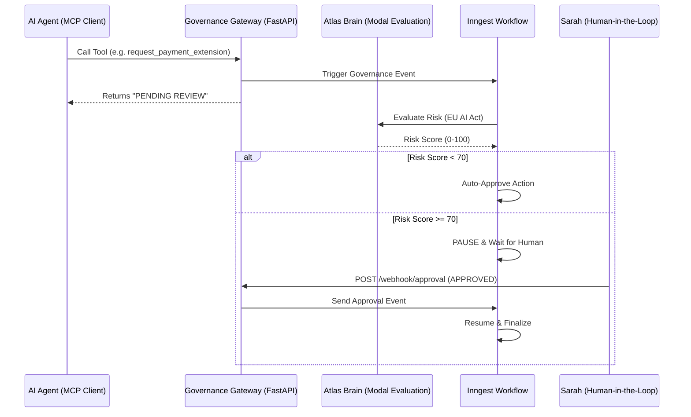

# ATLAS Governance Gateway (Phase 2)

**A Secure Middleware for AI Agents, powered by FastMCP, Inngest, and Modal.**

The **ATLAS Governance Gateway** is a centralized hub that intercepts AI Agent tool calls, evaluates potential risks using a generic LLM/SLM (hosted on Modal.com), and manages "Human-in-the-Loop" (HITL) escalations via durable **Inngest** workflows.

> **Logic Attribution**: The governance logic and dataset design are attributed to **Anna Ko <anna_ko@berkeley.edu>** (UC Berkeley). This implementation strictly follows the "approve -> auto_approve" deterministic flow for low-risk actions per project v3.0 findings.

## 🚀 Key Features

* **Durable Governance**: Uses [Inngest](https://www.inngest.com) to manage long-running human review workflows that survive server restarts.
* **FastMCP + FastAPI**: Exposes [Model Context Protocol (MCP)](https://modelcontextprotocol.io) tools via a robust generic web server.
* **Risk Evaluation**: Real-time checking against EU AI Act standards via `atlas-welfare-v1` on [Modal](https://modal.com).
* **Compliance**: Enforces Article 14 by pausing high-risk actions until human approval is received.
* **Secure Deployment**: Dockerized environment with secure credential management.

---

## 🛠️ Architecture



The system consists of three main components:

1. **Gateway (`gateway.py`)**: A **FastAPI** application that serves as the entry point.
    * **MCP Server**: Mounted at `/mcp/sse` to serve Agent tools (`check_status`, `request_extension`, etc.).
    * **Inngest Endpoint**: Served at `/api/inngest` to handle workflow triggers and step execution.
    * **Webhook**: Listens at `/webhook/approval` for external human approval signals.

2. **Workflows (`workflows.py`)**: Defines the durable business logic.
    * `handle_governance`: The core workflow that:
        1. Calls Modal to assess risk.
        2. Auto-approves usage if Risk Score < 70.
        3. Pauses and waits for `atlas/sarah.decision` event if Risk Score >= 70.

3. **Agent Integration**:
    * Any MCP-compliant agent (Claude Desktop, cursor, or custom scripts) can connect to the Gateway.

---

## 📦 Installation & Setup

### Prerequisites

* Docker Desktop installed and running.
* (Optional) `python 3.10+` if running locally without Docker.

### Quick Start (Docker)

We provide a `setup.sh` script to automate the configuration and deployment.

1. **Run the Setup Script**:

    ```bash
    ./setup.sh
    ```

2. **Configuration**:
    The script will prompt you for:
    * **Modal Function Name**: (Default: `nislam-mics/ATLAS-NIST-Measure`)
    * **AI Backend**: Choose OpenAI or Local LLM (Ollama).
    * **Inngest Keys**: Event Key and Signing Key (Required for Production).
    * **Modal Credentials**: Token ID and Secret.

    *Note: The script creates a `.env` file automatically. DO NOT commit this file.*

3. **Usage**:
    The script will build the Docker image `atlas-gateway` and run it on port `8000`.

---

## 🔌 Endpoints

Once running, the Gateway exposes the following endpoints on `http://localhost:8000`:

| Endpoint | Method | Description |
| :--- | :--- | :--- |
| `/` | GET | Health check and status. |
| `/mcp/sse` | GET | **MCP Endpoint**. Connect your AI Agent here. |
| `/mcp/messages` | POST | MCP Protocol messages (handled by FastMCP). |
| `/api/inngest` | POST | **Inngest Webhook**. Connects to Inngest Cloud. |
| `/webhook/approval` | POST | **Human Approval Webhook**. Simulate approval signals. |

---

## 🧪 Testing the Governance Flow

### 1. Manual Verification

Check if the gateway is running:

```bash
curl http://localhost:8000/
# Expected: {"status": "ATLAS Governance Gateway Running", ...}
```

### 2. End-to-End Simulation

We included a script `test_handshake.py` that simulates the entire flow without needing an external Agent.

1. Ensure the Gateway is running (via Docker or locally).
2. Run the test script:

    ```bash
    python test_handshake.py
    ```

3. **Flow**:
    * Script simulates an Agent calling `request_payment_extension` (High Risk).
    * Gateway returns `PENDING REVIEW`.
    * Inngest triggers a workflow run (check [Inngest Dashboard](https://app.inngest.com)).
    * Script waits... then sends an **Approval** signal to `/webhook/approval`.
    * Workflow completes.

## 🤖 AI Agent Prompt Instructions

To ensure your AI Agent correctly uses the Governance Gateway, include the following instructions in the Agent's **System Prompt**:

> ### 🛑 Governance Protocol
>
> 1. This environment is governed by the **ATLAS Governance Gateway**.
> 2. When you call a payment or high-risk tool, the gateway may return a message starting with `PENDING REVIEW (Ref: evt_...)`.
> 3. **DO NOT** assume the action failed.
> 4. **DO** inform the user that the request has been queued for human governance review and provide the Reference ID.
> 5. **DO NOT** retry the call immediately; wait for the system to process the background workflow.

---

## 🔄 Detailed Governance Procedure Call

The following sequence occurs when a high-risk tool is invoked.

### 1. Initial Tool Request (Agent -> Gateway)

**Endpoint**: `SSE /mcp/sse` (Streamed)

* **Request** (JSON-RPC):

    ```json
    {
      "method": "tools/call",
      "params": {
        "name": "request_payment_extension",
        "arguments": { "beneficiary_id": "BEN-123", "reason": "Hardship" }
      }
    }
    ```

* **Gateway Response**:

    ```text
    PENDING REVIEW (Ref: evt_48f1fb4b). Action queued subject to governance checks.
    ```

### 2. Risk Assessment (Inngest -> Modal)

**Endpoint**: `Modal.com (Inference API)`

* **Input**: Tool name and arguments.
* **Assessment Result**:

    ```json
    { "risk_score": 85, "classification": "HIGH_RISK", "action": "PAUSE" }
    ```

### 3. Case A: HITL Required (Risk >= 70)

If the **Atlas Brain** determines the action is high-risk, a notification is sent to the human reviewer (**Sarah**).

* **Sarah's Workflow**:
    1. Sarah receives a notification via Inngest/Webhook.
    2. Sarah reviews the `reason` and `beneficiary_id`.
    3. Sarah approves: `POST /webhook/approval`

    ```json
    { "decision": "APPROVED", "event_id": "evt_48f1fb4b" }
    ```

* **Workflow Result**: Workflow resumes and marks the tool execution as `AUTHORIZED`.

### 4. Case B: Auto-Approval (Risk < 70)

If the action is deemed low-risk (e.g., standard status check or well-documented low-value extension), the system skips human intervention.

* **Workflow Result**: The workflow proceeds immediately to completion without waiting for an external signal.
* **Audit Log**: "Auto-approved based on Risk Score [X] per Article 14 Compliance."

### 5. Workflow Resolution (Inngest)

The `atlas/sarah.decision` event resumes the workflow. The final authorization is logged in the Inngest dashboard.

---

## 📂 Project Structure

* `gateway.py`: Main server entry point (FastAPI + FastMCP).
* `workflows.py`: Inngest workflow definitions and client initialization.
* `setup.sh`: Automated setup and deployment script.
* `Dockerfile`: Container definition (Secure, no secrets baked in).
* `requirements.txt`: Python dependencies.
* `test_handshake.py`: Verification utility.

---

## 🔒 Security Notes

* **Secrets**: Never bake API keys into the Docker image. Always pass them via `--env-file` or environment variables at runtime.
* **Inngest Signing**: Production deployments MUST verify the `INNGEST_SIGNING_KEY` to prevent unauthorized workflow triggers. This is enforced in `workflows.py`.
